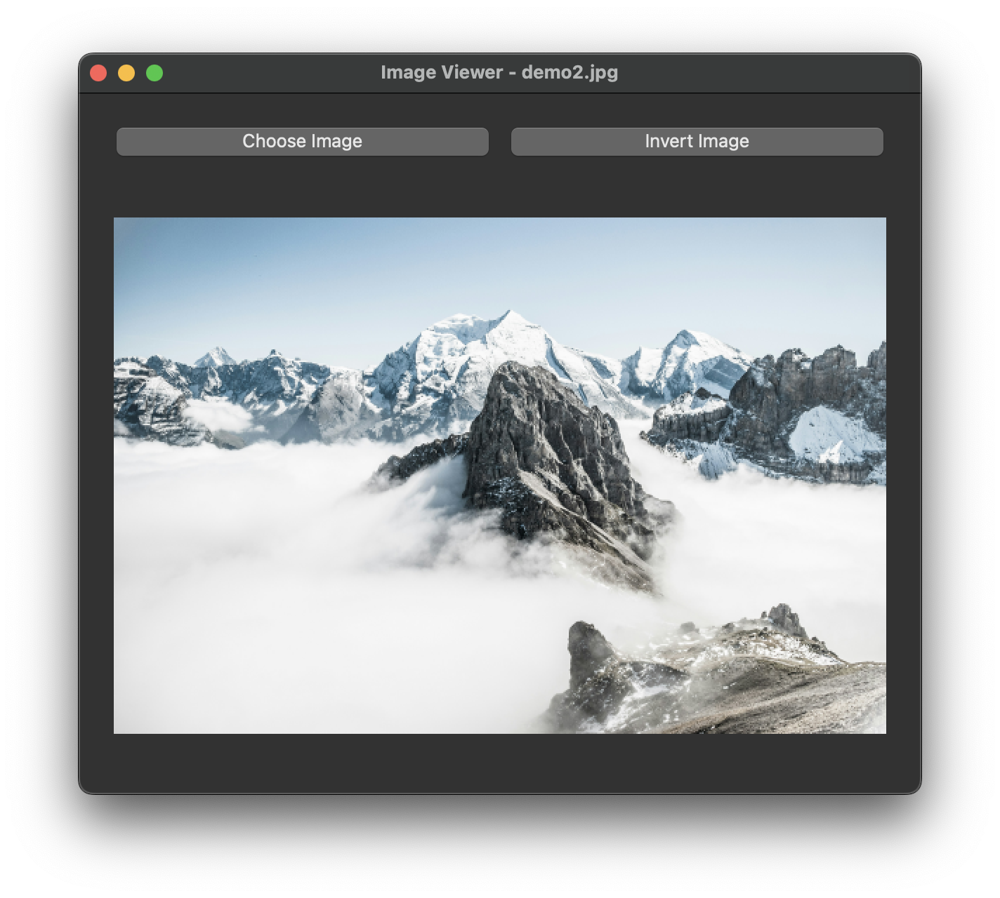
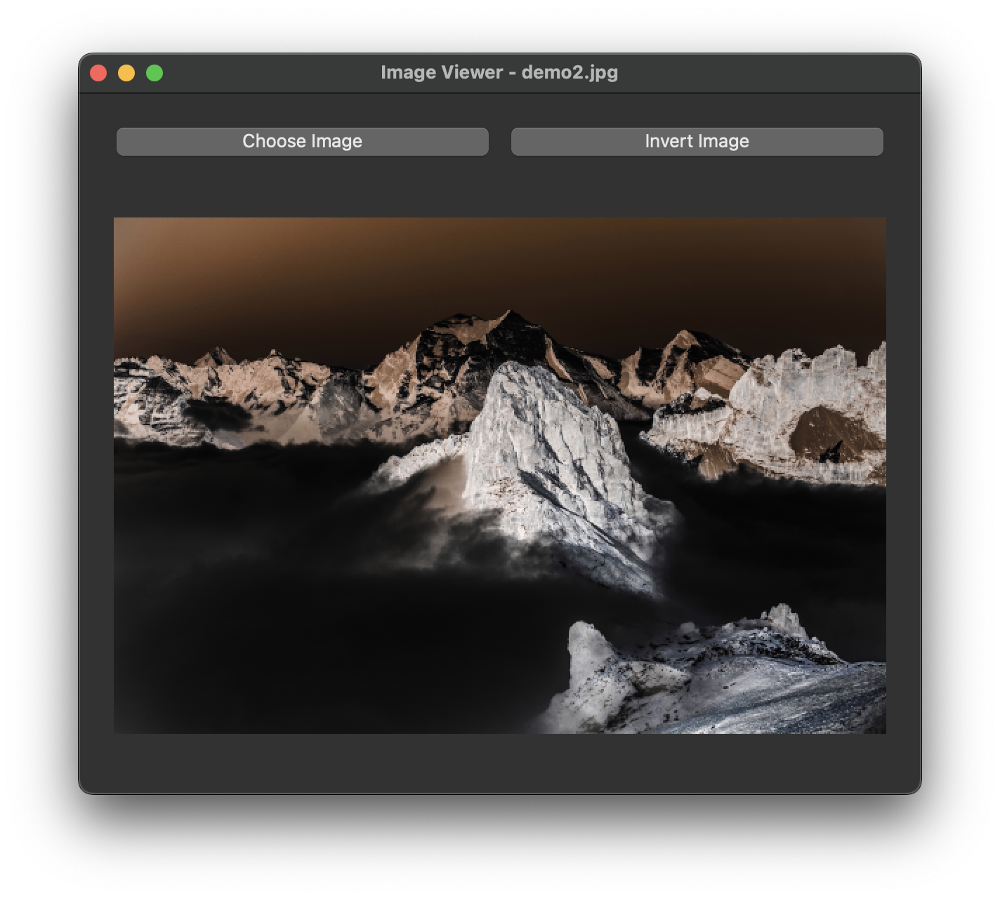

<h1 align="center">Image Viewer & Inverter</h1>

<div align="center">
   


</div>

<div align="center">
    
    
</div>

A simple and interactive desktop application built with **PyQt5** that allows users to **view** and **invert** images with a single click.

---

## Features

- Open and display images in **PNG, JPG, BMP, GIF, and XPM** formats.
- Maintain the original aspect ratio while scaling images to fit the window.
- **Inverts image colors** with a single button click.
- Toggle between the **original** and **inverted** views seamlessly.

---

## Requirements

Ensure you have the following installed:

- **Python 3.6+**
- **PyQt5** (for the graphical interface)

---

## Installation

1. Install Python if you haven't already ([Download Python](https://www.python.org/downloads/)).
2. Open a terminal and install the required dependency:
   
   ```bash
   pip install PyQt5
   ```

---

## Usage

To launch the application, simply run:

```bash
python image_viewer.py
```

### **Instructions:**
1. Click **"Choose Image"** to open a file dialog.
2. Select an image from your files.
3. Click **"Invert Image"** to switch between the original and inverted versions.

---

## How It Works

The program consists of a **simple graphical interface** built with PyQt5:

- A **window** that displays the selected image.
- A **button** to load an image from your files.
- Another **button** to apply color inversion.

### **Color Inversion Process:**
1. The image is loaded into memory.
2. Each pixel's **red, green, and blue (RGB)** values are inverted.
3. The modified image is displayed.

---

## Future Improvements

This project can be enhanced with:
- **More image editing options** (brightness, contrast adjustments, filters, etc.).
- **Zoom and pan functionality** for better image exploration.
- **Save feature** to export modified images.
- **A more refined user interface** with menus and keyboard shortcuts.

---

## Acknowledgements

Developed as part of the **PROJ201 Undergraduate Project Course** at **Sabancı University**.
